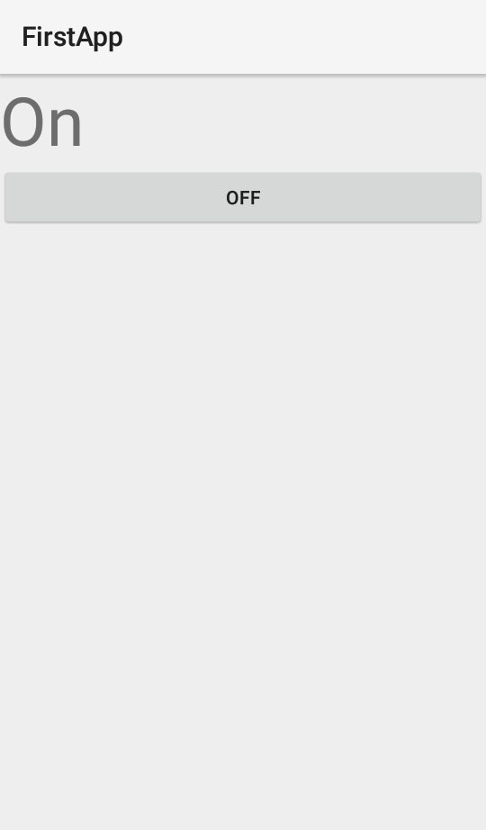

# FirstApp_VOC

This is a native Android app written in Python, using the BeeWare suite.

The Python code is compiled to Java bytecode using VOC, and the Android APK is packaged using briefcase.

Requirements

JDK
Android SDK
How to run

Ensure that you have Android SDK installed.

Install the Python development requirements:

pip install -r requirements-dev.txt
Plug in your Android device or start an emulator.

Build and run the app:

python setup.py android
(cd android && ./gradlew run)

Thanks a lot to @eliasdorneles for helping me to use of BeeWare suite.

## Want to know more?

If you liked this, you might like:

* [Native Android drawing app written in Python](https://github.com/eliasdorneles/drawingapp-voc)
* [Template for native Android apps written in Python](https://github.com/eliasdorneles/beeware-android-template)
* [Video of a talk explaining how VOC works](https://www.youtube.com/watch?v=9c4DEYIXYCM)
